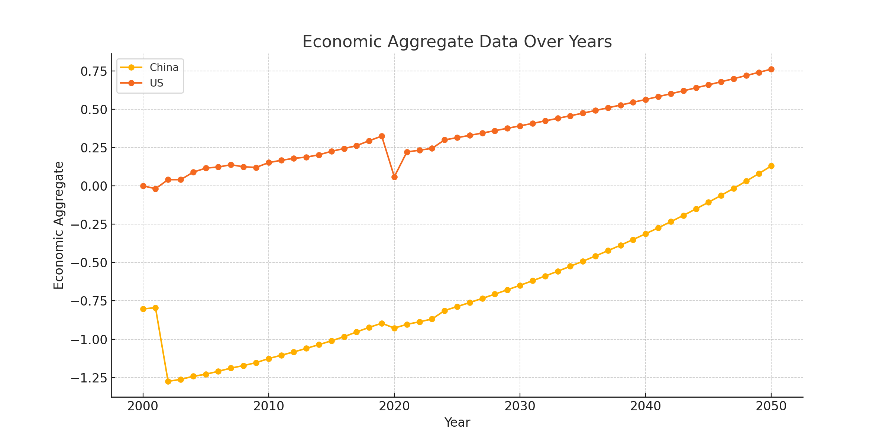
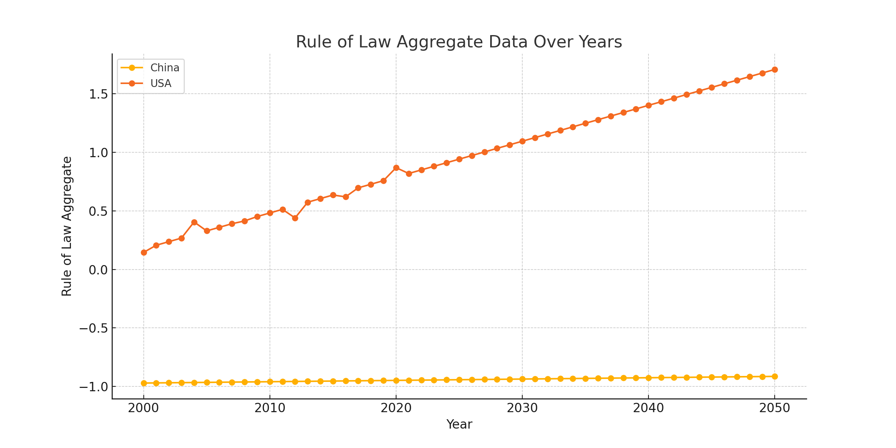
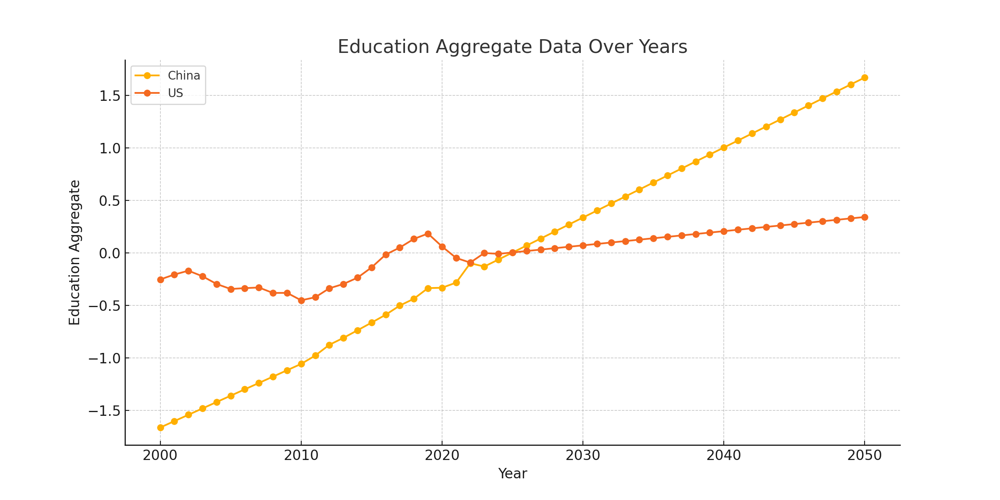
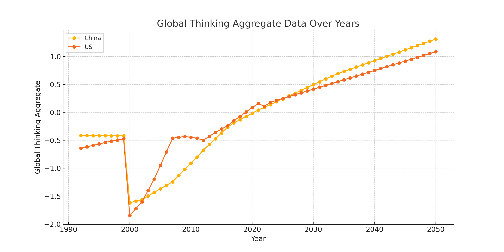
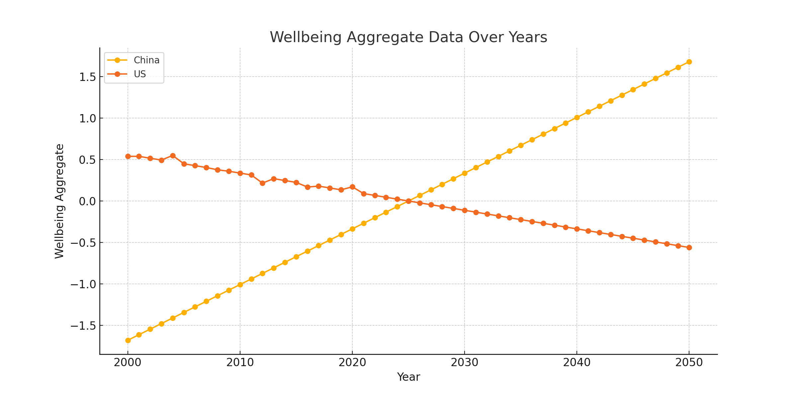
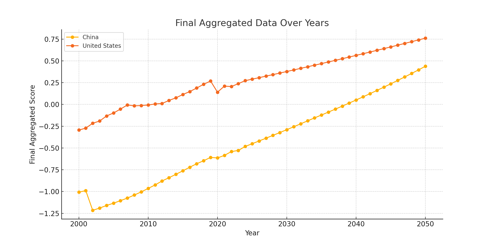

# Changing-World-Order

This project focuses on a comprehensive comparative analysis between the United States and China across multiple key metrics over several decades. The goal is to predict a future point where the overall scores of these two countries might intersect, indicating a potential shift in global standings.

## Categories and Subcategories

The analysis encompasses five major categories, each containing specific subcategories that provide a granular view of various aspects of national performance:

### 1. Economics
- **GDP per Capita**: A measure of the average economic output per person.
- **Infrastructure**: Evaluation of the physical and organizational structures needed for the operation of a society.
- **GINI Index**: Assessment of income inequality within the population.
- **Purchasing Power Parity (PPP)**: Comparison of economic productivity and standards of living between countries.
- **Labor Productivity**: Measurement of economic output per labor hour.

### 2. Education
- **Graduates**: The number of individuals completing tertiary education.
- **Higher Education Enrollment**: The rate at which individuals are enrolling in higher education institutions.
- **Innovation Index**: Evaluation of a country's capacity for innovation and development.

### 3. Wellbeing
- **Life Expectancy**: Average lifespan of individuals in the country.
- **Voter Turnout**: The percentage of eligible voters who participate in elections.

### 4. Rule of Law
- **Control of Corruption**: The extent to which public power is exercised for private gain.
- **Homicide Rate**: The number of homicides per 100,000 inhabitants.

### 5. Global Thinking
- **Globalization Index**: The degree of economic, social, and political globalization.
- **FDI Outflow**: The investment outflows from a country to the rest of the world.
- **FDI Inflow**: The investment inflows into a country from the rest of the world.
- **Tourism**: The number of international tourists and their economic impact.
- **Internet Access**: The percentage of the population with access to the internet.

## Project Goals

By analyzing these diverse metrics, this project aims to:
- Understand the historical trends and trajectories of the United States and China in these key areas.
- Identify patterns and correlations that could predict future shifts in national standings.
- Provide a data-driven prediction of if and when China might reach parity with or surpass the United States in terms of overall performance across these categories.

This analysis will be valuable for policymakers, economists, and researchers interested in the evolving dynamics of global power and development.

## Data Collection Challenges and Solutions

Originally, this project included many more subcategories and two additional categories. However, changes were made for several reasons.

Throughout this process, many datasets were removed because their values were ratios. Additionally, some datasets lacked sufficient legitimate data to perform linear regression and create future datasets. 

This issue was particularly pronounced with data from China, where many metrics were either completely omitted or had significantly different ratings compared to non-government sources.

The datasets ultimately used in this analysis were those that were the most cross-verifiable and the best fit our criteria for weighting.

The data currently utilized in this analysis is organized by set values that vary by year and are not represented as ratios. Future data were inferred based on existing data using linear regression. 

These extrapolated datasets were normalized using z-score method around the mean of the data for each dataset.

## Approach by Weightage

<b>A quick disclaimer.</b> The main fault with my project is in this section. Not the weightage system itself, but purely how based off opinion it was. I decided what sections were important, and I decided how important each of those were. It is without doubt that others will disagree on how important each of these categories are, or if they should even be categories. However, it is what I, and many prominent Geopoliticists and Economists consider the core of nation building so it is what I chose.

The reason I decided to use weightage for this project was because of necessity. I think it's impossible to rank where a nation actually is purely on the basis of one factor like Economicsor Military, which is what I often see. Country's need to be ranked by various factors that aren't neccesarily directly influencing each other in order to give us a macro view of what's actually happening.

This in turn leads to the weightage. Obviously not every category is going to be weighted the same, despite all of them being important. Economics is still by far the biggest section here, for obvious reasons. However, its weight is equivalent to the rest of the categories added up, balancing it out significantly. 

The weightage is out of 100. Weightage for each category is given below

- Economics - 50/100 

- Rule of Law - 10/90

- Education - 10/90

- Global Thinking - 15/90

- Wellbeing - 15/100

### Economic Weightage Breakdown

- GDP/C - (15/50)  

- Infrastructure - (5/50) 

- GINI (Wealth Inequality Indexy) - (10/50) 

- PPP (Purchasing Power Parity) Growth - (15/50) 

- Labor Productivity - (5/50)  

### Rule of Law Breakdown

- Control of Corruption - (5/10)

- Homicide Growth - (5 /10)

### Education

- Graduates - (4/10)

- Higher Education Enrollment - (4/10)

- Innovation Index - (2/10)

### Global Thinking

- Globalization Index (3/15)

- FDI Outflow (4/15)

- FDI Inflow (4/15)

- Tourism (1/15)

- Internet Access (3/15)

### Wellbeing

- Life Expectancy (10/15)

- Voter Turnout (5/15)

# Aggregating Datasets

The weightage for each subcategory was applied to corresponding datasets, which means multiplying each data element in the datasets with the corresponding weights. This weighted data elements for each year is added for every subcategory to produce the single dataset for each category, producing one aggregated datset for each main category. 

### Producing the Final Single Dataset

The above procedure is repeated using the weights for each main category mentioned above to produce the final aggregated dataset for China and United States from the Years 2000 - 2050. 

# Final Results

The following sections show the detailed results of each main category with both tabular data and the graph.

### Economics

| Year |     China     |       US       |
|------|---------------|----------------|
| 2000 |  -0.802798    |   0.001134     |
| 2001 |  -0.794458    |  -0.017690     |
| 2002 |  -1.275411    |   0.041165     |
| 2003 |  -1.262873    |   0.041098     |
| 2004 |  -1.242475    |   0.090281     |
| 2005 |  -1.208929    |   0.116144     |
| 2006 |  -1.182445    |   0.142763     |
| 2007 |  -1.148904    |   0.169036     |
| 2008 |  -1.150178    |   0.195334     |
| 2009 |  -1.184254    |   0.222198     |
| 2010 |  -1.146470    |   0.247931     |
| 2011 |  -1.119249    |   0.272015     |
| 2012 |  -1.085215    |   0.296132     |
| 2013 |  -1.049788    |   0.320635     |
| 2014 |  -1.010645    |   0.344640     |
| 2015 |  -0.976145    |   0.369105     |
| 2016 |  -0.943409    |   0.393291     |
| 2017 |  -0.902210    |   0.418079     |
| 2018 |  -0.871216    |   0.442739     |
| 2019 |  -0.842695    |   0.467431     |
| 2020 |  -0.815407    |   0.491946     |
| 2021 |  -0.789927    |   0.515832     |
| 2022 |  -0.765522    |   0.539711     |

### Rule of Law

| Year |     China     |       USA       |
|------|---------------|-----------------|
| 2000 |  -0.970686    |   0.145263      |
| 2001 |  -0.969551    |   0.206567      |
| 2002 |  -0.968416    |   0.237223      |
| 2003 |  -0.967280    |   0.267879      |
| 2004 |  -0.966145    |   0.405556      |
| 2005 |  -0.965010    |   0.543234      |
| 2006 |  -0.963875    |   0.680911      |
| 2007 |  -0.962740    |   0.818589      |
| 2008 |  -0.961605    |   0.956266      |
| 2009 |  -0.960470    |   1.093944      |
| 2010 |  -0.959335    |   1.231621      |
| 2011 |  -0.958200    |   1.369299      |
| 2012 |  -0.957065    |   1.506976      |
| 2013 |  -0.955930    |   1.644654      |
| 2014 |  -0.954795    |   1.782331      |
| 2015 |  -0.953660    |   1.920009      |
| 2016 |  -0.952525    |   2.057686      |
| 2017 |  -0.951390    |   2.195364      |
| 2018 |  -0.950255    |   2.333041      |
| 2019 |  -0.949120    |   2.470719      |
| 2020 |  -0.947985    |   2.608396      |
| 2021 |  -0.946850    |   2.746074      |
| 2022 |  -0.945715    |   2.883751      |

### Education

| Year |     China     |       US       |
|------|---------------|----------------|
| 2000 |  -1.661551    |  -0.252067     |
| 2001 |  -1.601012    |  -0.205327     |
| 2002 |  -1.540473    |  -0.168812     |
| 2003 |  -1.479934    |  -0.221778     |
| 2004 |  -1.419396    |  -0.295197     |
| 2005 |  -1.358857    |  -0.368616     |
| 2006 |  -1.298318    |  -0.442035     |
| 2007 |  -1.237779    |  -0.515454     |
| 2008 |  -1.177240    |  -0.588873     |
| 2009 |  -1.116701    |  -0.662292     |
| 2010 |  -1.056163    |  -0.735711     |
| 2011 |  -0.995624    |  -0.809130     |
| 2012 |  -0.935085    |  -0.882549     |
| 2013 |  -0.874546    |  -0.955968     |
| 2014 |  -0.814007    |  -1.029387     |
| 2015 |  -0.753468    |  -1.102806     |
| 2016 |  -0.692929    |  -1.176225     |
| 2017 |  -0.632391    |  -1.249644     |
| 2018 |  -0.571852    |  -1.323063     |
| 2019 |  -0.511313    |  -1.396482     |
| 2020 |  -0.450774    |  -1.469901     |
| 2021 |  -0.390235    |  -1.543320     |
| 2022 |  -0.329696    |  -1.616739     |

### Global Thinking

| Year |     China     |       US       |
|------|---------------|----------------|
| 1992 |  -0.412398    |  -0.642119     |
| 1993 |  -0.413624    |  -0.616194     |
| 1994 |  -0.414850    |  -0.590269     |
| 1995 |  -0.416076    |  -0.564344     |
| 1996 |  -0.417302    |  -0.538419     |
| 1997 |  -0.418528    |  -0.512494     |
| 1998 |  -0.419754    |  -0.486569     |
| 1999 |  -0.420980    |  -0.460644     |
| 2000 |  -0.422206    |  -0.434719     |
| 2001 |  -0.423432    |  -0.408794     |
| 2002 |  -0.424658    |  -0.382869     |
| 2003 |  -0.425884    |  -0.356944     |
| 2004 |  -0.427110    |  -0.331019     |
| 2005 |  -0.428336    |  -0.305094     |
| 2006 |  -0.429562    |  -0.279169     |
| 2007 |  -0.430788    |  -0.253244     |
| 2008 |  -0.432014    |  -0.227319     |
| 2009 |  -0.433240    |  -0.201394     |
| 2010 |  -0.434466    |  -0.175469     |
| 2011 |  -0.435692    |  -0.149544     |
| 2012 |  -0.436918    |  -0.123619     |
| 2013 |  -0.438144    |  -0.097694     |
| 2014 |  -0.439370    |  -0.071769     |
| 2015 |  -0.440596    |  -0.045844     |
| 2016 |  -0.441822    |  -0.019919     |
| 2017 |  -0.443048    |   0.006006     |
| 2018 |  -0.444274    |   0.031931     |
| 2019 |  -0.445500    |   0.057856     |
| 2020 |  -0.446726    |   0.083781     |
| 2021 |  -0.447952    |   0.109706     |
| 2022 |  -0.449178    |   0.135631     |

### Wellbeing

| Year |     China     |       US       |
|------|---------------|----------------|
| 2000 |  -1.681682    |   0.539035     |
| 2001 |  -1.614415    |   0.538961     |
| 2002 |  -1.547147    |   0.516504     |
| 2003 |  -1.479880    |   0.494047     |
| 2004 |  -1.412613    |   0.549750     |
| 2005 |  -1.345345    |   0.605453     |
| 2006 |  -1.278078    |   0.661156     |
| 2007 |  -1.210811    |   0.716859     |
| 2008 |  -1.143543    |   0.772562     |
| 2009 |  -1.076276    |   0.828265     |
| 2010 |  -1.009009    |   0.883968     |
| 2011 |  -0.941741    |   0.939671     |
| 2012 |  -0.874474    |   0.995374     |
| 2013 |  -0.807207    |   1.051077     |
| 2014 |  -0.739939    |   1.106780     |
| 2015 |  -0.672672    |   1.162483     |
| 2016 |  -0.605405    |   1.218186     |
| 2017 |  -0.538137    |   1.273889     |
| 2018 |  -0.470870    |   1.329592     |
| 2019 |  -0.403603    |   1.385295     |
| 2020 |  -0.336335    |   1.440998     |
| 2021 |  -0.269068    |   1.496701     |
| 2022 |  -0.201801    |   1.552404     |

# Final Aggregate Dataset

| Year |     China     |   United States   |
|------|---------------|-------------------|
| 2000 |  -1.007121    |   -0.294041       |
| 2001 |  -0.988981    |   -0.271986       |
| 2002 |  -1.215480    |   -0.215894       |
| 2003 |  -1.189477    |   -0.190510       |
| 2004 |  -1.159544    |   -0.132084       |
| 2005 |  -1.125764    |   -0.088552       |
| 2006 |  -1.094835    |   -0.058432       |
| 2007 |  -1.064371    |   -0.023594       |
| 2008 |  -1.082303    |   -0.016902       |
| 2009 |  -1.093785    |    0.001352       |
| 2010 |  -1.065153    |    0.032769       |
| 2011 |  -1.040992    |    0.048136       |
| 2012 |  -1.007218    |    0.071160       |
| 2013 |  -0.972165    |    0.091878       |
| 2014 |  -0.931333    |    0.117340       |
| 2015 |  -0.895158    |    0.141544       |
| 2016 |  -0.860206    |    0.167134       |
| 2017 |  -0.818991    |    0.193795       |
| 2018 |  -0.785080    |    0.219193       |
| 2019 |  -0.753726    |    0.243862       |
| 2020 |  -0.723619    |    0.269361       |
| 2021 |  -0.694476    |    0.292383       |
| 2022 |  -0.666528    |    0.316420       |

# Conclusion
Though much of our data has been inferred, it still seems to all paint a similar picture. Through each of the categories with the exception of Rule of Law, there is a somwhat consistent pattern to note.

China typically starts at either an almost even position, or much lower than the US, with the 2010's to late 2020's seeing a significant increase in status for them, that then continues to grow  (of course, using a linear regression model positive growth will be applied for all future years when in reality this is often not the case). 

China ends up taking the lead from the US by 2050 in some major categories, such as Wellbeing, Global Thinking and most apparently Education. The only category where this pattern is not followed is the Rule of Law Section. In fairness, Rule of Law had by far the least data available on it so the most of it was extrapolated compared to other sections.

The US is extremely erratic in its placements. It typically starts almost even, or with a large lead, with positive growth that seems to reach a peak in 2020, before dipping and continuing positive growth albeit at a lower rate. Indeed, it isn't that the U.S is dropping steadily in any metric (apart from Wellbeing, which also has data magnitude on par of Rule of Law), it's simply slowing down.  The exceptions are Global thinking and Economics, where the US manages to stay very close to or stay ahead of China in the end.

The weightage of Economics is what ends up putting the US over China in the end, but it is clear that China's overall rate of growth is not only higher, but more balanced through each category.

Perhaps the most significant finding of this was that COVID indeed played a tremendous role in the global standing of these nations. Although China's growth didn't improve from COVID (and it indeed witnessed a drop for around 2 years in important categories) it hasn't slowed down nearly as much as the US in terms of its growth since. The US meanwhile shows slightly to much lower growths in every category apart from Global Thinking. 

In conclusion, what's to come is more up in the air than ever. This study with all my biases on weightage and categories at least, seems to idicate that there will be a time in my life where China does overtake the US as the dominant power on the globe. I studied this because it's a phenomenon that happens throughout history, indeed it was the US who took the throne last in the 1940's from the British, who took it from the Dutch, who took it from the Spanish, who took it from...Chinese. 

However what will end up happening is still on all of us to wait, no amount of Analysis can ever make up for the sheer randomness this world and its people provides. If you made it all the way through I thank you for reading, and shall take my leave.

# References

- Innovation Index Score - https://www.wipo.int/global_innovation_index/en/ 

- Graduations  
US - http://en.moe.gov.cn/documents/statistics/2022/national/202401/t20240110_1099530.html, https://www.statista.com/statistics/238164/bachelors-degree-recipients-in-the-us/, https://www.statista.com/topics/2245/higher-education-graduation-in-the-us/#statisticChapter 
China - http://en.moe.gov.cn/documents/statistics/2022/national/202401/t20240110_1099530.html 

- Life Expectancy - https://www.who.int/data/gho/data/indicators/indicator-details/GHO/life-expectancy-at-birth-(years) 

-  Voter Turnout - https://www.idea.int/data-tools/data/voter-turnout-database 
https://www.statista.com/topics/1247/chinese-communist-party/#topicOverview 

- GINI Wealth Gap
https://en.wikipedia.org/wiki/List_of_sovereign_states_by_wealth_inequality 

- Crime Rates (Murder and Violent Crime) - https://www.macrotrends.net/countries/USA/united-states/murder-homicide-rate 

- Control of Corruption -  
https://www.worldbank.org/en/publication/worldwide-governance-indicators/interactive-data-access 

- Labor Productivity - https://ilostat.ilo.org/topiScorescs/labour-productivity/# 

- Infrastructure Spending and Effectiveness - https://www.fitchsolutions.com/bmi/infrastructure-key-projects-data

- Travel and Tourism - ​​https://data.worldbank.org/indicator/ST.INT.ARVL?locations=US-CN&name_desc=false 

- Globalization Index - https://kof.ethz.ch/en/forecasts-and-indicators/indicators/kof-globalisation-index.html  

- Foreign Direct Investment -
https://unctad.org/data-visualization/global-foreign-direct-investment-flows-over-last-30-years 

- Internet Access - https://data.worldbank.org/indicator/IT.NET.USER.ZS 